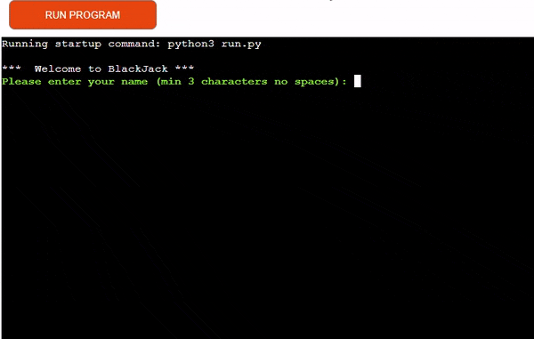

# BlackJack

)

This application is a Python based BlackJack game, requesting the user to enter their name
prior to playing the game.

Link to [live site](https://blackjack-pgrant-e8836bcdd18d.herokuapp.com)

## Index - Table of Contents

- [Features](#features)
    - [Existing Features](#existing-features)
    - [Future Features](#possible-future-features)

- [UX](#ux)
    - [Site Goals](#site-goals)
    - [User Stories](#user-stories)
    
- [Technology Used](#technologies)

- [Logical flow](#logical-flow) 

- [Testing](#testing) 
    - [Validator Testing](#validator-testing)
    - [Manual Testing](#manual-testing)
    - [Fixed Bugs](#fixed-bugs)
    - [Unfixed Bugs](#unfixed-bugs)

- [Deployment](#deployment)

- [Credits](#credits)


##


## Features

The site contains all necessary features of a simple, functioning BlackJack game.

### Existing Features


- **Welcome & Player Name entry**
    - Press 'RUN PROGRAM' to begin the game
    - User will be requested to enter their name (min of 3 letters no spaces)	
    	

    

- **Option Menu**
    - After valid player name entry player will be presented with a Options Menu
    - Choices are 
        1. View Instructions
        2. Start Game
          

    

- **View Instructions Option**

    - Lists out 11 instructions on how to play the game
    - Options menu will appear at the end of the instructions


    
    
- **Game Area**
    - The main feature of the app
    - Player and Dealer will be dealt 2 cards, one of the dealers cards will remain unseen (X).
    - A total for the Player card value will be displayed `(Value: xx)`
    - Player will be offered the choice to take another card `hit` (h) to allow them to get to target value of 21 or to keep their current card value by choosing `stand` (s)
    - If player chooses another card and the value exceeds 21 they are bust and the dealer wins.
    - If they select another card or stand and are under the value 21 the dealer is then dealt a card, dealer will try to beat players value or bust, this will determine winner of game.

    

- **Play Again**
    - Upon completion of a game, player will be offered the choice of play again `y` or finish the game by choosing `n`
    - If player chooses to play again the terminal will clear and a new game will commence.	
    


    
    

- **Game Complete**
    - Should player choose to finish the game by choosing `n`, the result of the game will appear and a Thank You message to the player will be displayed	
    
    

- **Error messages** 
   - If Player does not enter the correct number of letters, enters invalid characters or enters a space when entering their name they will receive an error telling them their entry was invalid and the reason why.
   - During the game if the player enters a character other than `(h)` for Hit or `(s)` for Stand they will also receive an error stating Invalid input. Please enter 'h' or 's'.

   
   


   ## Possible Future Features

- **Playing Cards**
    - Use Ascii to create playing card image, welcome message and congratulations graphic. 


 ## UX

### Site Goals

The goal of this app is to provide a simple game of BlackJack, allowing players the choice to hit or stand to try and beat the dealer.
The game is intended to be played over the course of a few minutes. It does not take up too much of the players's time by playing, functionality or reading instructions.

### User Stories

**As a site visitor I want to:**

- read a brief and simple description of how to play
- be able to play the game with simple click interaction
- view the card value for both player and dealer
- be clearly informed of the result of each game
- have a total of wins and losses at the end of the game

**As the site administrator I want to:**

- be able to make modifications to the game (see [future features](#possible-future-features))
- offer the user the chance to explore the code for the site 

## Technologies
- Heroku
    - Used to deploy and host the application
- Python
    - Code used to create the application
- CodeAnywhere
    - The app was developed using Visual Studio Code IDE https://app.codeanywhere.com/
- GitHub
    - Source code is hosted on GitHub and deployed using Heroku.
- Git
    - Used for version control
- Colorama
    - Adding colored terminal text to the game (https://pypi.org/project/colorama/) 
- Screen Recorder
    - Capture game play for title gif
    - https://chrome.google.com/webstore/detail/screen-recorder/hniebljpgcogalllopnjokppmgbhaden
- ezgif
    - Used to create the title gif (https://ezgif.com/)


##  Logical Flow


## Testing

### Validator Testing- 

- CI Python Linter ([PEP CI Validator](https://pep8ci.herokuapp.com/))

    


### Manual Testing

| Test | Result |
|--|--|
|On run programme the welcome message appears|Pass|
|After welcome message player prompted for name|Pass|
|Once name is input the menu option presents|Pass|
|Selecting 1 from the menu opens the instructions|Pass|
|Selecting 2 from the menu starts the game |Pass|
|Dealer hand hidden during first round|Pass|
|When player stands dealer card is shown|Pass|
|When dealer stands the endgame calculation runs to determine winner|Pass|
|If player wins the players score is incremented|Pass|
|If the player wins they are informed with a message|Pass|
|If the dealer wins the players losses score is incremented|Pass|
|If the dealer wins the player is given a lose message|Pass|
|If the hand is a tie the player is notified|Pass|
|If the hand is a tie, neither player or dealers score increases|Pass|
|At the end of the game the player is informed of the final score|Pass|
|At the end of the game the player is thanked for playing|Pass|


### Testing User Stories

| Expectation (As a user, I want to...)  | Result (As a user, I...)    |
| :---------------------------------: | :------------------------------:|
| Get a quick and thorough overview of the sites features and functionalities | Can find my way around the app easily and quickly with all areas being layed out intuitively |
| Read a brief and simple description of how to play | Can read the game instructions from the options menu in very little time |
| Be able to play the game with simple click interactions | Play the game by simply clicking the `h` or `s` keys and `y` or `n` to continue or finish the game|
| Receive the total score at the end of the game  | When i clicked `n` to end the game the total of how many games I won and lost appeared along with a thank you message |


### Fixed bugs

- Text line length greater 79 characters
- Clear Terminal positioning
- Whitespaces
- Expected 2 blank lines after class or function definition, found 1


### Unfixed bugs

- none

## Deployment

### Version Control

The site was created using the CodeAnywhere code editor and pushed to github to the remote repository [here](https://github.com/PatrickG0308/PP3-BlackJack) .

The following git commands were used throughout development to push code to the remote repo:

```git add .```  - This command was used to add the file(s) to the staging area before they are committed.

```git commit -m “commit message”```  - This command was used to commit changes to the local repository queue ready for the final step.

```git push```  - This command was used to push all committed code to the remote repository on github.

### Deployment through Heroku

The below steps were followed to deploy this project to Heroku:

* Go to Heroku and click "New" to create a new app.
* Choose an app name and region, click "Create app".
* Go to "Settings" and navigate to Config Vars. Add the following config variables:
    * PORT : 8000
* Navigate to Buildpacks and add buildpacks for Python and NodeJS (in that order).
* Navigate to "Deploy". 
* Set the deployment method to Github and enter repository name and connect.
* Scroll down to Manual Deploy, select "main" branch and click "Deploy Branch".
* The app will now be deployed to heroku

The live link can be found [here](https://blackjack-pgrant-e8836bcdd18d.herokuapp.com/)

### Clone the Repository Code Locally

Navigate to the GitHub Repository you want to clone to use locally:

- Click on the code drop down button
- Click on HTTPS
- Copy the repository link to the clipboard
- Open your IDE of choice (git must be installed for the next steps)
- Type git clone copied-git-url into the IDE terminal

The project will now of been cloned on your local machine for use.